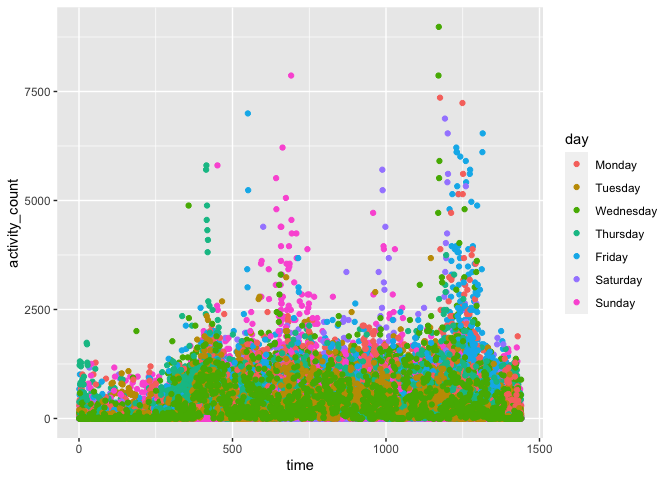

Homework 3
================
Laura Gomez

``` r
library(tidyverse)
```

    ## ── Attaching packages ───────────────────────────────────────────────────── tidyverse 1.3.0 ──

    ## ✓ ggplot2 3.3.2     ✓ purrr   0.3.4
    ## ✓ tibble  3.0.3     ✓ dplyr   1.0.2
    ## ✓ tidyr   1.1.2     ✓ stringr 1.4.0
    ## ✓ readr   1.3.1     ✓ forcats 0.5.0

    ## ── Conflicts ──────────────────────────────────────────────────────── tidyverse_conflicts() ──
    ## x dplyr::filter() masks stats::filter()
    ## x dplyr::lag()    masks stats::lag()

``` r
library(p8105.datasets)
data("instacart")
```

## Problem 1

How many aisles are there, and which aisles are the most items ordered
from? Make a plot that shows the number of items ordered in each aisle,
limiting this to aisles with more than 10000 items ordered. Arrange
aisles sensibly, and organize your plot so others can read it. Make a
table showing the three most popular items in each of the aisles “baking
ingredients”, “dog food care”, and “packaged vegetables fruits”. Include
the number of times each item is ordered in your table. Make a table
showing the mean hour of the day at which Pink Lady Apples and Coffee
Ice Cream are ordered on each day of the week; format this table for
human readers (i.e. produce a 2 x 7 table).

## Problem 2

Import and clean the accelerometer dataset. Then add the weekday vs
weekend variable and encode data with reasonable variable classes

``` r
accelerometer_df = read_csv("./Data/accel_data.csv") %>%
  janitor::clean_names() %>%
  drop_na()  %>%
  pivot_longer(activity_1:activity_1440, names_to = 'time', names_prefix = 'activity_', values_to = 'activity_count') %>% 
  mutate(
    day = as.factor(day), 
    time = as.numeric(time)) %>% 
  mutate(
    weekend = ifelse(day == c("Saturday", "Sunday"),1,0), 
    weekend = case_when(weekend == 1 ~ "weekend", weekend == 0 ~ "weekday" )) %>%
  mutate(
    day = forcats::fct_relevel(
      day, "Monday", "Tuesday","Wednesday", "Thursday", "Friday", "Saturday", "Sunday" ))
```

    ## Parsed with column specification:
    ## cols(
    ##   .default = col_double(),
    ##   day = col_character()
    ## )

    ## See spec(...) for full column specifications.

The accelerometer dataset contains information self-reported physical
activity over a 24 hour cycle. The following variables exist in the
dataset activity\_count, day, day\_id, time, week, weekend. There are a
total of 50400 rows and 6 columns in our final dataset.

Aggregate accross minutes to create a total activity variable for each
day, and create a table showing these totals. Are any trends apparent?

``` r
aggregate_activity_df = 
  accelerometer_df %>% 
  group_by(time) %>% 
  summarize(total_activity_df = sum(activity_count, na.rm = TRUE)) 
```

    ## `summarise()` ungrouping output (override with `.groups` argument)

``` r
#%>% knitr::kable(aggregate_activity_df)
```

Make a single-panel plot that shows the 24-hour activity time courses
for each day and use color to indicate day of the week. Describe in
words any patterns or conclusions you can make based on this graph.

``` r
accelerometer_df %>%
  ggplot(aes(x = time, y = activity_count, color = day)) + 
  geom_point() 
```

<!-- -->

``` r
#fix order of data 
```

Describe in words any patterns or conclusions you can make based on this
graph.

## Problem 3

Import data

``` r
library(p8105.datasets)
data("ny_noaa")
```

To that end, write a short description of the dataset, noting the size
and structure of the data, describing some key variables, and indicating
the extent to which missing data is an issue.

``` r
ny_noaa_df = ny_noaa %>% separate('date', c( 'year','month','day')) %>% 
  mutate(
    year = factor(year), 
    month = factor(month), 
    day = factor(day), 
    prcp =
      as.integer(prcp), 
    tmax = as.integer(tmax), 
    tmin = as.integer(tmin)) %>% 
  drop_na()
```
